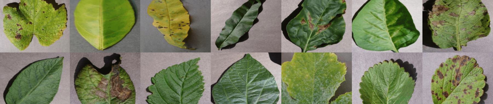

# Identificação de Doenças em Plantas com Redes Neurais Convolucionais

## Índice

- [Introdução](#introdução)
- [Objetivo do Projeto](#objetivo-do-projeto)
- [Dataset](#dataset)
- [Como Funciona](#como-funciona)
- [Arquitetura do Modelo](#arquitetura-do-modelo)
- [Treinamento e Avaliação](#treinamento-e-avaliação)
- [Conclusão](#conclusão)
- [Contato](#contato)

---

## Introdução

Este projeto foi desenvolvido para identificar **doenças em plantas** a partir de imagens de folhas. Utilizando técnicas de **Visão Computacional** e **Inteligência Artificial**.

---

## Objetivo do Projeto

O objetivo principal deste projeto é desenvolver um modelo que seja capaz de **classificar imagens de folhas** em diferentes categorias, como "saudável" ou "infectada por alguma doença".

Por meio deste projeto, pude aplicar e aprimorar minhas habilidades em **machine Learning**, **visão computacional**, **inteligência artificial**.

---

## Dataset

Utilizamos o **PlantVillage Dataset**, um dos maiores e mais utilizados conjuntos de dados para o estudo de doçenças em plantas. Esse dataset possui milhares de imagens de folhas, tanto **saudáveis** quanto **afetadas por diferentes doenças**.

- **Plantas Incluídas**: Tomate, Maçã, Uva, Pimenta, Batata, entre outras.
- **Classes**: Cada planta possui imagens em categorias como "saudável" ou com doenças específicas, como "mancha preta", "míldio", etc.

As imagens têm uma resolução de 256x256 pixels e estão divididas em várias classes, facilitando a criação de modelos de classificação.

[Download do DataSet](https://www.kaggle.com/datasets/abdallahalidev/plantvillage-dataset)
---

## Como Funciona

1. **Coleta de Dados**: O dataset é carregado e dividido entre conjuntos de **treinamento**, **validação**, e **teste**.
2. **Processamento das Imagens**: As imagens são processadas para padronização, incluindo redimensionamento e normalização dos pixels.
3. **Treinamento do Modelo**: Utilizamos uma **Rede Neural Convolucional (CNN)**, treinada para aprender padrões que diferenciam folhas saudáveis das doentes.
4. **Predição**: Depois de treinado, o modelo é capaz de receber novas imagens de folhas prevendo qual a classe da folha e classificar se estão saudáveis ou com alguma doença.

---

## Arquitetura do Modelo

O modelo desenvolvido é uma **Rede Neural Convolucional (CNN)**, escolhida por ser particularmente eficaz em tarefas de **classificação de imagens**. A CNN foi composta por:

- **Camadas Convolucionais**: Para extrair características das imagens.
- **Camadas de Pooling**: Para reduzir as dimensões das características, evitando sobreajuste.
- **Camada Flatten**: Para converter as características 2D em um vetor 1D.
- **Camadas Densas**: Para realizar a classificação.
- **Camada Dropout**: Para prevenir overfitting.

**[Código do Modelo](src/model.py)**

---

## Treinamento e Avaliação

### Treinamento

Para o treinamento, usamos as imagens já existentes no dataset. O processo de treinamento foi gerenciado pelo script `train.py`.

**[Código do Treinamento](src/train.py)**

### Avaliação

O modelo foi avaliado no conjunto de teste para medir sua precisão e capacidade de generalização. As principais métricas usadas foram:

- **Acurácia**
- **Precison**
- **Recall**
- **F1-score**

- **Acurácia no Conjunto de Teste**: ~94,62%

O modelo foi utilizado para fazer inferencia em 6 novas imagens novas da WEB.

**[Código de Avaliação](notebooks/evaluate.ipynb)**

---

## Conclusão

O projeto foi capaz de atingir uma boa acurácia na identificação de doenças em plantas, mostrando a eficácia das Redes Neurais Convolucionais para aplicações na agricultura.

Este projeto demonstra como a **Inteligência Artificial** pode ser utilizada para resolver problemas do mundo real, melhorando a eficiência e a produtividade na agricultura.

---

## Contato

- **Email**: works.danielsilva@gmail.com
- **LinkedIn**: [Daniel Silva](https://www.linkedin.com/in/daniel-silva-b73857214/)
- **Portfólio**: [Daniel Silva](https://danielsilvaportfolio-45bdec2430ab.herokuapp.com/)
